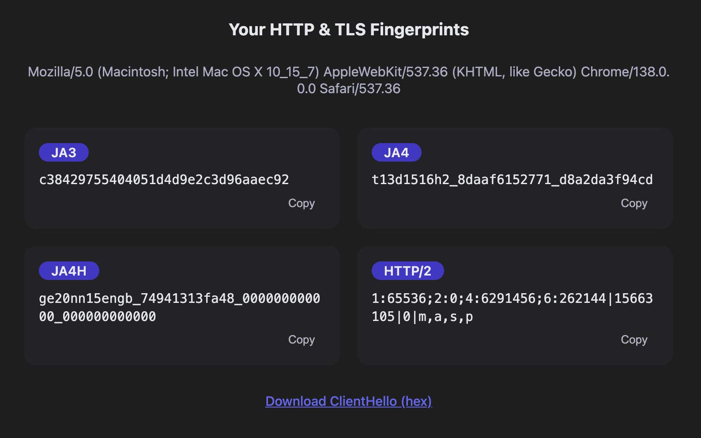

<p align="center"></p>

# Fingerprint‑Aware TLS Reverse Proxy

Finch is a lightweight reverse proxy written in Go. It inspects TLS handshakes and HTTP requests to extract JA3, JA4, JA4H, and Akamai HTTP/2 fingerprints, then evaluates them—alongside the rest of the request metadata—against flexible, hot‑reloadable rules written in HCL. On a per‑request basis, Finch can:

- **allow** legitimate traffic  
- **deny** or **tarpit** scanners  
- **route** clients to alternate upstreams  
- **deceive** attackers with on‑the‑fly, LLM‑generated responses via [Galah](https://github.com/0x4D31/galah)

Finch also offers an authenticated admin API for live configuration and rule updates, a real‑time SSE feed for observability, Suricata HTTP rule matching, and an echo mode for testing or dataset collection. Experimental HTTP/3 and QUIC fingerprinting support is included. Use Finch to block scrapers and other unwanted traffic, slow down scanners, or deploy dynamic honeypots.

> **Status: v0.1.0 – not production‑ready.**  
> Finch is under active development and may contain bugs or breaking changes.
> Please test thoroughly before deploying, and open an issue or pull request if you find a problem or can contribute improvements.

### Key Features

- **Fingerprint extraction** – Capture [JA3](https://engineering.salesforce.com/tls-fingerprinting-with-ja3-and-ja3s-247362855967/), [JA4](https://github.com/FoxIO-LLC/ja4/blob/main/technical_details/JA4.md), [JA4H](https://github.com/FoxIO-LLC/ja4/blob/main/technical_details/JA4H.md), and [Akamai HTTP/2](https://www.blackhat.com/docs/eu-17/materials/eu-17-Shuster-Passive-Fingerprinting-Of-HTTP2-Clients-wp.pdf) fingerprints for every request, providing high‑fidelity identification of client libraries and TLS stacks.
- **Flexible rule engine** – Define policies using [HCL](https://github.com/hashicorp/hcl) that evaluate fingerprints, HTTP methods and paths, header values, source‑IP ranges, and Suricata alert messages. Rules can nest `when all` / `when any` blocks and decide whether to `allow`, `deny`, `route`, or `deceive` each request. See the [Rule Schema](docs/rule-schema.md) for details.
- **Suricata HTTP rules** – Finch loads Suricata `.rules`, evaluates requests against them, hot‑reloads rules on changes, logs matches, and exposes each matched rule’s `msg` to your HCL policies—no Suricata installation needed.
- **Deception mode** – Trigger the `deceive` action to serve LLM‑generated honeypot responses via [Galah](https://github.com/0x4D31/galah) or slow scanners with a configurable tarpit.  
- **Live event feed** – Stream structured JSON events over Server‑Sent Events (SSE) for immediate visibility.  
- **Echo mode** – Run a standalone server that echoes fingerprint data—ideal for testing and dataset collection.
- **Multiple listeners & hot reloads** – Define multiple listeners, each with its own upstream, TLS certificate, rule file, and log. Finch hot‑reloads configuration and rule files automatically whenever they change or when it receives `SIGHUP`.  
- **HTTP/3 & QUIC support** (experimental) – Parse QUIC Initial packets to generate JA4 fingerprints and apply the rule engine to HTTP/3 traffic.  


## Installation

### Building from source

Finch requires Go 1.24 or newer. Clone the repository and build:

```bash
git clone https://github.com/0x4D31/finch.git
cd finch
go build -o finch ./cmd/finch
# or embed a version string at compile time
export VERSION=v0.1.0
go build -ldflags "-X main.version=${VERSION}" -o finch ./cmd/finch
```

A `Makefile` defines tasks like building (`make build`), running unit tests (`make test`), running [golangci‑lint](https://golangci-lint.run/) (`make lint`) and building a Docker image (`make docker-build`).  `make build` injects the current Git tag as the version.

### Docker

Build the container image:

```bash
docker build --build-arg VERSION=v0.1.0 -t finch:v0.1.0 .
```

The container listens on port 8443. Configure listeners and upstreams via environment variables (e.g. `FINCH_LISTEN`, `FINCH_UPSTREAM`) or flags. When running in a container, publish port 8443 and mount your configuration and rule files. Do not mix `FINCH_LISTEN`/`--listen` with `--config`.

## Quick Start

Run Finch without a configuration file using quick‑mode flags:

```bash
finch serve --listen :8443 --rule-file my.rules.hcl \
            --upstream http://localhost:8080
```

For production, provide an HCL config:

```bash
finch serve --config configs/finch.hcl
```

Useful flags include:

| Flag                            | Purpose                                                        |
| ------------------------------- | -------------------------------------------------------------- |
| `--listen`                      | Bind address for quick mode (repeatable).                      |
| `--upstream`                    | Default upstream URL for proxying requests.                    |
| `--rule-file`                   | Path to the HCL rule file when using quick mode.               |
| `--access-log`                  | Path to the JSONL access log.                                  |
| `--log-level`                   | Set log level (`debug`, `info`, `warn`, `error`).              |
| `finch validate --config FILE`  | Validate a main config file.                                   |
| `finch validate --rules FILE`   | Validate a rule file only.                                     |
| `finch echo --listen ADDR`      | Run an echo server                                             |
| `--upstream-ca-file`            | PEM file containing CAs trusted for upstream HTTPS.            |
| `--upstream-skip-tls-verify`    | Skip verification of upstream certificates (use with caution). |
| `--admin-addr`/`--enable-admin` | Enable and configure the admin API.                            |
| `--sse-addr`/`--enable-sse`     | Enable and configure the SSE feed.                             |
| `--admin-token`                 | Bearer token required for the admin API.                       |

Finch automatically reloads its configuration and rule files when they change or when it receives a `SIGHUP`.

## Configuration

For complex deployments write a configuration file in HCL. A top‑level `defaults` block provides inherited settings for listeners. Relative paths are resolved relative to the config file’s directory. Command‑line flags and environment variables override fields in the `defaults` block or top‑level `admin`/`sse` settings, but cannot override per‑listener fields when `--config` is provided.

Example configuration:

```hcl
defaults {
  rule_file        = "/etc/finch/default.rules.hcl"
  access_log       = "/var/log/finch/events.jsonl"
  default_action   = "deny"
}

suricata {
  enabled   = true
  rules_dir = "/etc/suricata/rules"
}

admin {
  enabled = true
  addr    = "127.0.0.1:9035"
  token   = "super‑secret"
}

sse { enabled = true }

listener "public" {
  id       = "public"
  bind     = "0.0.0.0:8443"
  upstream = "http://localhost:8080"
  tls {
    cert = "/path/to/cert.pem"
    key  = "/path/to/key.pem"
  }
  access_log = "/var/log/finch/public.jsonl"
}

listener "honeypot" {
  id        = "hp"
  bind      = "0.0.0.0:9443"
  upstream  = "http://localhost:8081"
  rule_file = "/etc/finch/hp.rules.hcl"
}
```

See [Configuration](docs/configuration.md) for a detailed description of every field and configuration precedence.

## Rule Engine

Rules are written in HCL and define an `action` (`allow`, `deny`, `route` or `deceive`), optional metadata (e.g. `upstream`, `strip_prefix`, `expires`, `deception_mode`) and a `when` block containing conditions. The top‑level `when` block can be labelled `when all` (AND) or `when any` (OR); omitting the label implies `all`.

Condition fields include TLS and HTTP fingerprints, HTTP methods and paths, header maps, client IP ranges and Suricata messages. Prefix (`^`), exact (`=`) and regex (`~`) matching operators are supported. See [Rule Schema](docs/rule-schema.md) for full details and examples.

Example ruleset:
```hcl
# Block a known scanner by JA3 fingerprint
rule "block-scanner-ja3" {
  action = "deny"

  when {
    tls_ja3 = ["3518c438fe56bd7dba3f6e28example"]  # ZMap TLS fingerprint
  }
}

# Deceive anything that matches an evasive JA4 profile
rule "deception-rule" {
  action         = "deceive"
  deception_mode = "tarpit"        # or "galah" for AI‑generated responses

  when any {                       # match if any field is true
    tls_ja4   = ["q13d0312h3_55b375c5d22e_c183556c78e2"]
    http_ja4h = ["^ bad-ja4h"]
  }
}

# Block requests with a suspicious header value
rule "block-bad-header" {
  action = "deny"

  when {
    http_header = {
      "user-agent" = ["^ EvilBot/"]
    }
  }
}
```

## Echo Mode

`finch echo` starts a server that returns fingerprint information instead of proxying. Endpoints include:

* `/` – returns an HTML page showing the user agent and generated fingerprints.
* `/fp/` – returns a compact JSON object of fingerprints.
* `/fp/detail` – returns a detailed JSON object including TLS ClientHello fields, HTTP headers, HTTP/2 frame data and fingerprints.

Echo mode disables the SSE feed and rule evaluation.



## Suricata HTTP Rule Support

If the `suricata` block is enabled and a `rules_dir` is specified, Finch watches all `.rules` files in that directory and reloads them automatically. Matched Suricata messages can be referenced in Finch rules via the `suricata_msg` field. Currently, only a subset of Suricata’s HTTP keywords are supported, and PCRE handling is limited. For a list of supported keywords and additional details, refer to the Galah [Suricata package](https://github.com/0x4D31/galah/tree/main/docs/SURICATA.md) documentation.

## Server‑Sent Events

When enabled (via `--enable-sse`/`sse.enabled`) Finch exposes a live SSE feed at `/events` on the address specified by `--sse-addr` (default `:9036`). Each event is a JSON object identical to the access log entries. See [sse-client](docs/sse-client.html) for a simple client example.

## Admin API

The admin API (experimental) listens on the address provided via `--admin-addr` or `admin.addr`.  Set `--enable-admin=false` or `admin.enabled = false` to disable it. If a bearer token is configured (`--admin-token` or `admin.token`), requests must include `Authorization: Bearer <token>` (case‑sensitive). Endpoints include:

* `GET /config` – return the active configuration as formatted JSON, with an `ETag` header.
* `POST /load` – replace the configuration with the request body (HCL or JSON).  Requires an `If-Match` header containing the current `ETag`.
* `POST /stop` – gracefully stop Finch.
* `GET /rulesets` – list rule files with IDs and listeners referencing them.
* `GET /rulesets/{id}` / `POST /rulesets/{id}` / `DELETE /rulesets/{id}` – retrieve, update or delete rule files at runtime.
* `PUT /config/listeners/{name}/ruleset?id=<id>` – switch a listener to a different rule file.

All relative paths in configurations loaded via the admin API are resolved against Finch’s current working directory.

## Additional Tools

Finch ships an auxiliary CLI tool: **quic‑chdump** – extracts QUIC ClientHello messages from PCAPs or live traffic and logs the SNI and JA3/JA4 fingerprints. See [cmd/quic-chdump](cmd/quic-chdump/README.md) and [docs/http3-quic.md](docs/http3-quic.md) for more information.

## Testing and Linting

Run unit tests with:

```bash
go test ./...
```

Some proxy integration tests require open network sockets and are guarded by the build tag `skipproxy`. To run the full suite including proxy tests, add `-tags skipproxy`.

Static analysis is performed via [golangci‑lint](https://golangci-lint.run/) – run `make lint` to ensure code quality.

## Contributing

Contributions, bug reports and feature requests are welcome! Please open an issue or pull request. Ensure tests pass and `golangci‑lint` reports no warnings before submitting patches.

## License

Finch is developed by Adel “0x4D31” Ka and licensed under the [Apache License 2.0](LICENSE). It relies on the [fingerproxy](https://github.com/wi1dcard/fingerproxy) package, also licensed under Apache‑2.0. The integrated JA4H fingerprinting method is licensed under the [FoxIO License 1.1](https://github.com/FoxIO-LLC/ja4/blob/main/LICENSE) and includes certain usage restrictions.